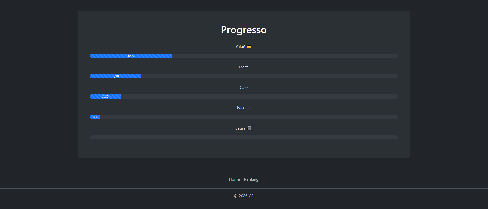

# 🏋️‍♂️ Contador de Academia

Um projeto simples, moderno e funcional para acompanhar o progresso de treinos na academia — ideal para quem quer registrar quantas vezes foi na academia de forma prática e visual.

# 🚀 Sobre o Projeto

O Contador de Academia foi desenvolvido com o objetivo de facilitar a contagem de treinos, uma competição saudável entre amigos. Com uma interface intuitiva e responsiva, o usuário pode incrementar ou decrementar contadores rapidamente, sem complicação.

# 🛠️ Tecnologias Utilizadas
⚛️ React
⚡ Vite
🎨 Bootstrap
🔥 Firebase (para persistência de dados, se aplicável)

# ✨ Funcionalidades
➕ Incremento de contadores
➖ Decremento de contadores
💾 Armazenamento de dados
📱 Interface responsiva

# 📸 Preview

# 📌 Próximas Melhorias

- Sistema de login

- Histórico de treinos

- Ranking todo mês

- Gráficos de evolução

# 💪 Motivação

"O progresso acontece um treino de cada vez."

Feito com dedicação para evoluir sempre 🚀
